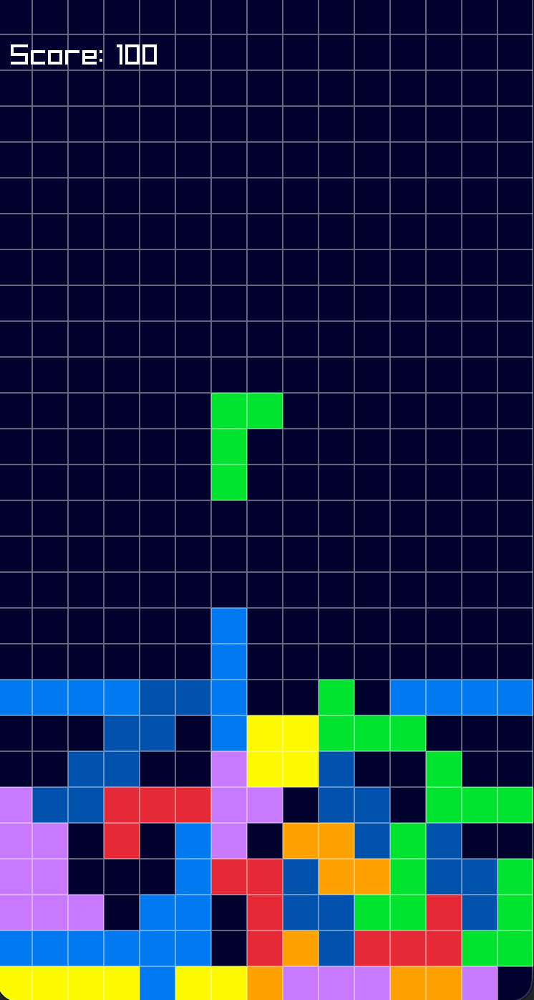

# Tetris Clone built with Raylib



A simple Tetris clone built using C++ and the [raylib](https://www.raylib.com/) library. 

## Prerequisites

Make sure you have a C++ compiler installed along with `raylib`. If you are on macOS, you can easily install `raylib` using Homebrew:

```bash
brew install raylib
```

## How to Build and Run

To compile the game, run the following command in your terminal:

```bash
clang++ main.cpp -o tetris -I/opt/homebrew/include -L/opt/homebrew/lib -lraylib -std=c++17
```

Once compiled, run the executable:

```bash
./tetris
```

## Controls

- **Mouse Movement**: Move left and right to control the active block.
- **Left Click**: Hard drop the block instantly to the bottom.
- **R**: Restart the game when it's game over.
